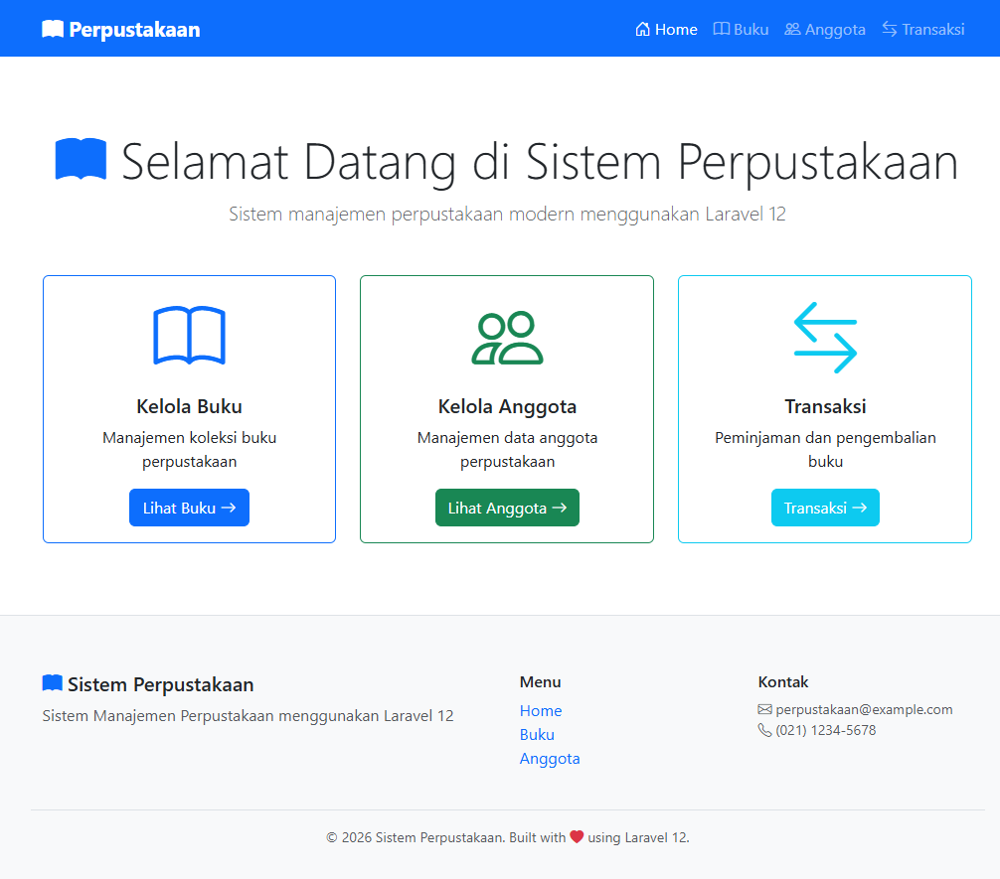
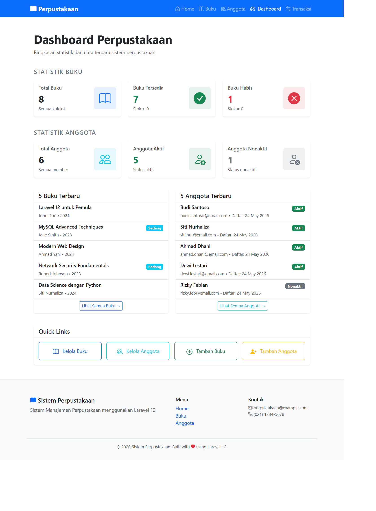
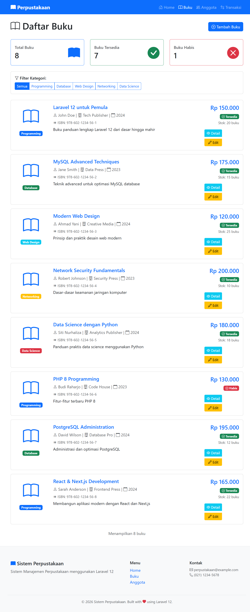
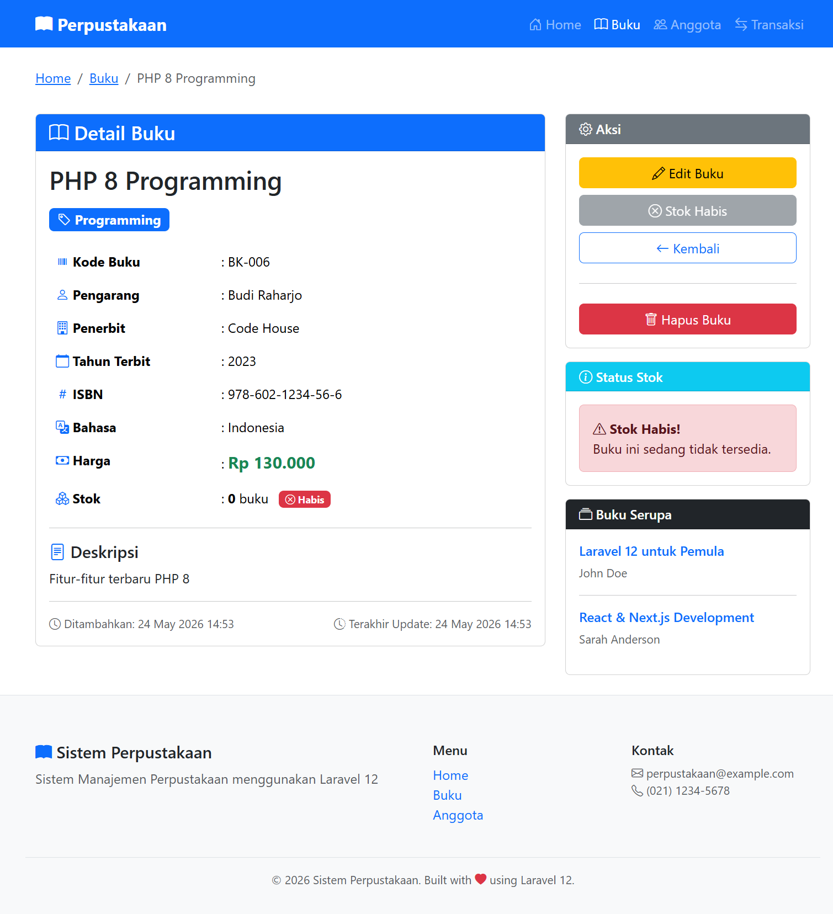
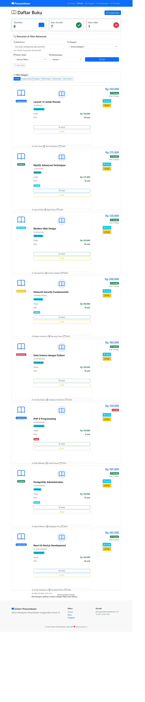
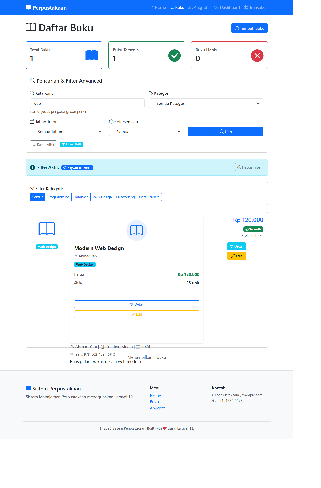
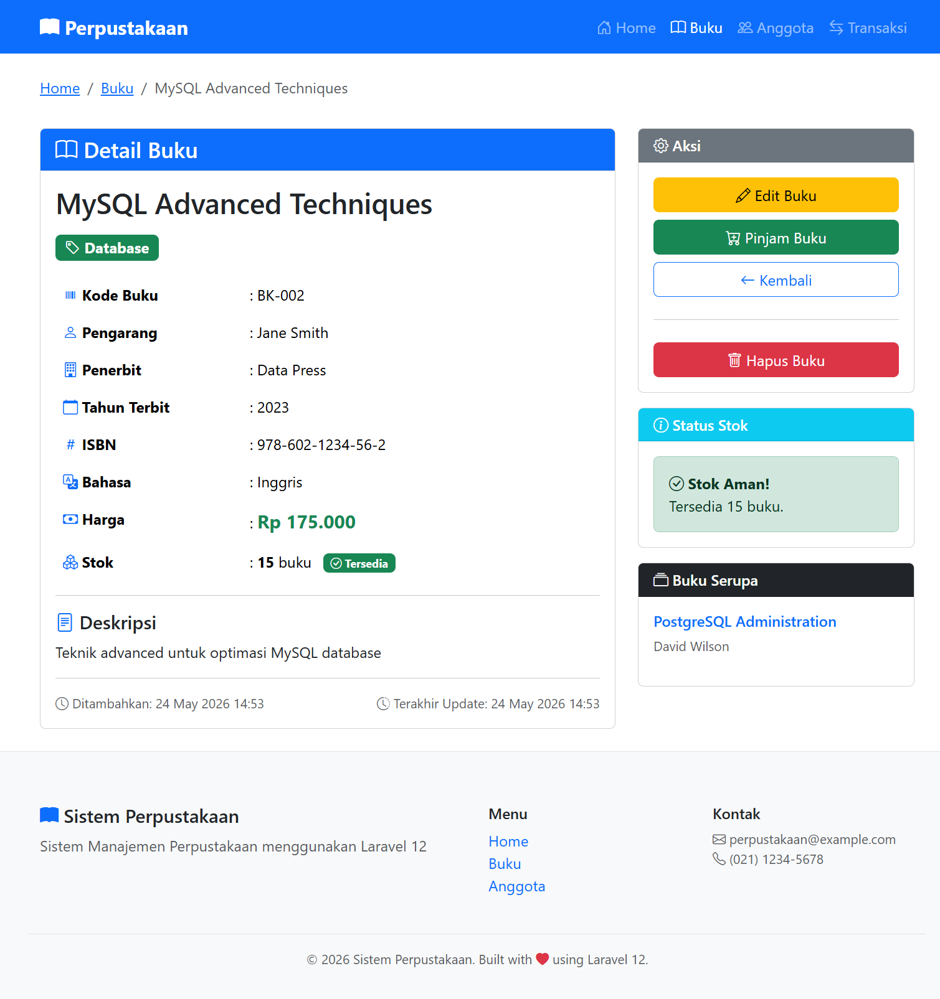

# Sistem Perpustakaan - Laravel

## Screenshot

### 1. Dashboard Perpustakaan (Tugas 1)

*Halaman dashboard menampilkan statistik buku, anggota, data terbaru, dan quick links*


*Dashboard dengan statistik lengkap dan navigasi*

---

### 2. Halaman Buku dengan Component (Tugas 2)

*Halaman daftar buku menggunakan Blade Component BukuCard*


*Implementasi Blade Component BukuCard yang reusable*


*Halaman buku dengan form search & filter advanced*

---

### 3. Search & Filter Advanced (Tugas 3)

*Hasil pencarian dengan keyword "web" - menampilkan filter aktif dan hasil yang sesuai*

---

### 4. Halaman Lainnya

*Halaman detail buku dengan informasi lengkap*

.png)
*Halaman daftar anggota perpustakaan*

---

##  Tugas 1: Dashboard Perpustakaan

### File yang Dibuat/Dimodifikasi (3 file)
1. `app/Http/Controllers/DashboardController.php` - Controller
2. `resources/views/dashboard/index.blade.php` - View
3. `routes/web.php` - Route

##  Tugas 2: Blade Component BukuCard

### File yang Dibuat (2 file)
1. `app/View/Components/BukuCard.php` - Component Class
2. `resources/views/components/buku-card.blade.php` - Component View

##  Tugas 3: Search & Filter Buku Advanced

### File yang Dimodifikasi (3 file)
1. `app/Http/Controllers/BukuController.php` - Tambah method search()
2. `resources/views/buku/index.blade.php` - Tambah form search
3. `routes/web.php` - Tambah route search

##  Struktur File Penting

```
app/
├── Http/Controllers/
│   ├── DashboardController.php    ← Tugas 1
│   └── BukuController.php         ← Tugas 3
└── View/Components/
    └── BukuCard.php               ← Tugas 2

resources/views/
├── dashboard/
│   └── index.blade.php            ← Tugas 1
├── components/
│   └── buku-card.blade.php        ← Tugas 2
└── buku/
    └── index.blade.php            ← Tugas 3

routes/
└── web.php                        ← Semua tugas
```

---

